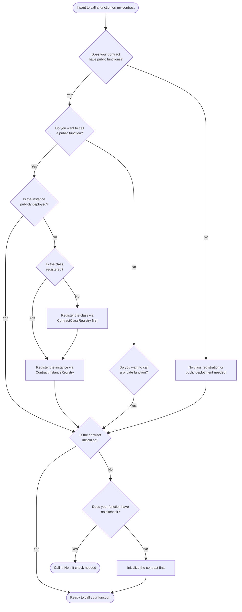

Deploying an Aztec contract is not a single operation—contracts progress through multiple states before they are fully operational. Understanding these states helps you decide which steps your contract needs and when different functions become callable.

## Overview

Unlike Ethereum where deployment is binary (deployed or not), Aztec contracts have distinct states:

1. **Contract Class Registration** - Publishing the contract bytecode
2. **Contract Instance Creation** - Computing a deterministic address
3. **Initialization** - Running the constructor
4. **Public Deployment** - Making the instance visible to the network
5. **Private Function Broadcasting** - Sharing private function artifacts (optional)

Not every contract needs every state. A private-only contract can skip class registration and public deployment entirely.

## Quick Start: What Do I Need to Do?

Use this decision tree to determine which steps your contract needs.



:::tip No initializer?
If your contract has no `#[initializer]` function and was deployed with `without_initializer()`, it's considered initialized immediately. Skip the initialization checks above.
:::

## Checking Contract State Programmatically

Use `wallet.getContractMetadata(contractAddress)` to check whether a contract is registered, published, and initialized. See [Verify deployment](../aztec-js/how_to_deploy_contract.md#verify-deployment) for usage examples and details on what the PXE checks automatically versus what you need to verify manually.

## The Contract Lifecycle States

### State 1: Contract Class Registration

A contract class is the bytecode and function definitions—the "template" for contract instances. Registration makes this class available network-wide via the `ContractClassRegistry`.

```text
ContractClassRegistry.publish() → class_id
```

Registering a contract class is required when:

- Your contract has public functions
- You want others to deploy instances of your class

You can skip class registration when:

- Private-only contracts (no public functions)
- Contracts where you're the only deployer

### State 2: Contract Instance Creation

An instance is a specific deployment of a class at a deterministic address. The address is computed from:

- Contract class ID
- Salt (user-provided randomness)
- Deployer address (optional, zero for universal deployment)
- Initialization hash (constructor + arguments)
- Public keys

Because the address is deterministic, you can compute it before any onchain action. This enables pre-funding accounts and counterfactual deployments.

### State 3: Initialization

Initialization runs the contract's constructor to set up initial state. Contracts can have:

- **Private initializer**: Runs in private context
- **Public initializer**: Runs in public context
- **No initializer**: Contract has no constructor. The contract is considered initialized immediately, so private functions are callable right after instance creation without needing `#[noinitcheck]`.

Mark your constructor function with the `#[initializer]` macro to designate it as an initializer. Functions marked with `#[noinitcheck]` can be called before initialization. See [defining initializer functions](./framework-description/functions/how_to_define_functions.md#define-initializer-functions) for details.

:::warning
Once deployed without an initializer, you cannot call initializers later. The address itself commits to having no initialization arguments. Choose your initialization strategy carefully.
:::

### State 4: Public Deployment

Public deployment broadcasts the contract instance to the network via `ContractInstanceRegistry.publish_for_public_execution()`. This emits a deployment nullifier that the network uses to route public function calls.

This step is required when your contract has public functions or public state that need to be callable.

You can skip public deployment when your contracts only have private functions.

For more details, see [Contract Deployment](../foundational-topics/contract_creation.md) for the conceptual foundation and [Deploying Contracts](../aztec-js/how_to_deploy_contract.md) for the practical guide.

### State 5: Private Function Broadcasting (Optional)

Private function artifacts can be shared offchain so others can call your private functions. This is optional—callers who already have the artifacts don't need them broadcast.

## When Can You Skip States?

| Contract Type             | Class Registration | Instance Creation | Initialization | Public Deployment |
| ------------------------- | ------------------ | ----------------- | -------------- | ----------------- |
| Private-only              | Optional           | Required          | Depends        | Skip              |
| Public-only               | Required           | Required          | Depends        | Required          |
| Hybrid (private + public) | Required           | Required          | Depends        | Required          |
| Stateless helper          | Optional           | Required          | Skip           | Depends           |

"Depends" means it depends on whether your contract has a constructor marked with `#[initializer]`.

## When Functions Become Callable

| State                               | Private Functions     | Public Functions |
| ----------------------------------- | --------------------- | ---------------- |
| Address computed only               | With `#[noinitcheck]` | No               |
| Class registered                    | With `#[noinitcheck]` | No               |
| Instance deployed (not initialized) | With `#[noinitcheck]` | No               |
| Initialized                         | Yes                   | No               |
| Publicly deployed                   | Yes                   | Yes              |

Private functions marked with `#[noinitcheck]` can be called as soon as you know the address, even before initialization. This enables patterns like pre-funded accounts.

:::note Contracts without initializers
If your contract has no initializer and is deployed with `without_initializer()`, it's considered initialized immediately. Private functions are callable right after instance creation without needing `#[noinitcheck]`. Public functions still require public deployment.
:::

## Portal Contracts (For Cross-Chain Contracts)

Portal contracts are L1 Solidity contracts that facilitate message passing between Ethereum and Aztec.

**What they do:**

- Send messages from L1 to L2 (deposits, commands)
- Receive messages from L2 on L1 (withdrawals, proofs)

**When needed:**

- Token bridges (moving assets between L1 and L2)
- Contracts that need to verify L1 state
- Any cross-chain messaging scenario

**When not needed:**

- Most contracts don't need a portal
- Purely Aztec (L2) applications

**Deployment order:**

1. Deploy the L1 portal contract first
2. Deploy the L2 contract with the portal address
3. The two contracts can now exchange messages

For implementation details, see [Communicating Cross-Chain](./framework-description/how_to_communicate_cross_chain.md).

## Proving Contract States (Advanced)

Your contract can verify the deployment or initialization state of other contracts. This is useful for:

- Ensuring a dependency contract is deployed before interacting
- Access control based on contract state
- Conditional logic based on initialization

```rust
use aztec::history::contract_inclusion::{
    ProveContractDeployment,
    ProveContractNonDeployment,
    ProveContractInitialization,
    ProveContractNonInitialization,
};

// Prove a contract is deployed
header.prove_contract_deployment(contract_address);

// Prove a contract is NOT deployed
header.prove_contract_non_deployment(contract_address);

// Prove a contract is initialized
header.prove_contract_initialization(contract_address);

// Prove a contract is NOT initialized
header.prove_contract_non_initialization(contract_address);
```

These functions prove inclusion or non-inclusion of the corresponding nullifiers in the nullifier tree at a given block.

## Further Reading

- [Contract Deployment](../foundational-topics/contract_creation.md) - Foundational concepts of classes and instances
- [Deploying Contracts](../aztec-js/how_to_deploy_contract.md) - TypeScript deployment guide
- [How to Pay Fees](../aztec-js/how_to_pay_fees.md) - Fee payment options
- [Communicating Cross-Chain](./framework-description/how_to_communicate_cross_chain.md) - Portal contracts and L1/L2 messaging
